# Rapport de projet — DevOps & AWS
## GameBoard — déploiement cloud d'une application de notation de jeux

**Auteur :** Rawane OUFFA — **Projet :** DevOps + AWS (couplé) — **Date :** juin 2026
**Dépôt GitLab :** _(lien du dépôt de rendu)_ · **Dépôt de travail/CI :** GitHub (mirroré)

---

## 1. Présentation et contexte

GameBoard est une application web (backend **Spring Boot 3 / Java 21**, frontend **Angular**, base **PostgreSQL**) de catalogue et notation de jeux de société. Conformément au sujet, **la qualité du code applicatif n'est pas l'objet du projet** : tout l'effort porte sur **l'industrialisation autour de l'application** — CI/CD, Infrastructure as Code, déploiement, supervision, sécurité et documentation.

Le déploiement cible **AWS Academy Learner Lab**, dont les contraintes ont structuré l'architecture :

| Contrainte Learner Lab | Impact |
|---|---|
| Région imposée `us-east-1` | Région verrouillée en variable |
| Sessions de 4 h, credentials rotatifs | Réexport des creds par session ; **state Terraform local** |
| Création de rôles IAM custom interdite | Réutilisation de **`LabRole`** / `LabInstanceProfile` |
| Budget limité | NAT unique, instances `*.micro`, RDS single-AZ |

---

## 2. Vue d'ensemble de l'architecture

```
                                Internet
       ┌───────────────────────────┼────────────────────────────┐
   S3 (statique)             ALB :80 (public)            EC2 monitoring :3000
   Frontend Angular                │ :8080                Grafana + agent CW
        │ appels API (CORS)        ▼                            │
        └──────────────►   ECS Fargate (privé)  ─── logs ──► CloudWatch
                          backend Spring Boot               ▲ métriques
                          2 tâches + autoscaling            │
                                  │ :5432                   │
                          RDS PostgreSQL (privé)  ──────────┘
```

Toute l'infrastructure est décrite en **Terraform** (`infra/`) et **Ansible** (`ansible/`). Détail technique : [ARCHITECTURE.md](ARCHITECTURE.md).

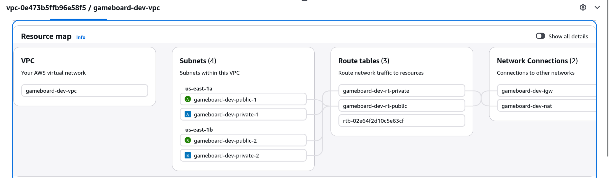
*Figure 1 — Carte des ressources du VPC (console AWS) : subnets publics/privés sur 2 AZ, IGW, NAT.*

---

## 3. Partie DevOps

### 3.1 CI/CD — GitHub Actions
Pipeline déclenchée sur chaque `push`/`pull_request` vers `main` :

- **`ci.yml`** — 3 jobs :
  - `backend` : JDK 21 → `mvnw verify` (tests sur profil H2) → build image Docker → **scan Trivy**.
  - `frontend` : Node → build Angular → build image → **scan Trivy**.
  - `trivy-repo` : **scan filesystem** (dépendances + secrets + misconfigurations IaC).
- **`codeql.yml`** — analyse statique de sécurité (SAST) Java et JS/TS.
- **`mirror-gitlab.yml`** — mirroring automatique vers le dépôt GitLab de rendu.

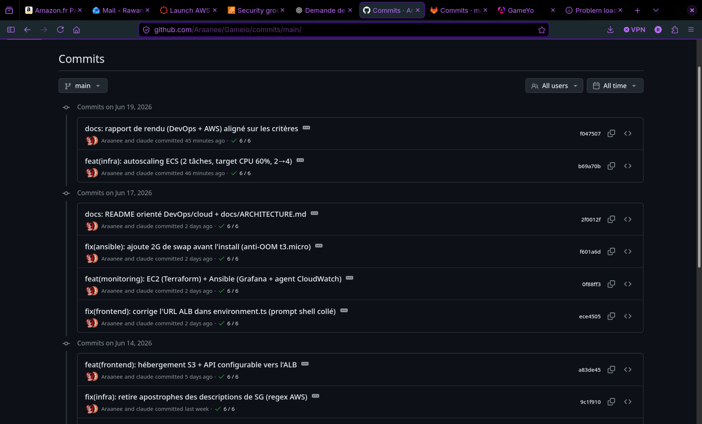
*Figure 2b — Historique de commits sur GitHub (dépôt de travail/CI).*

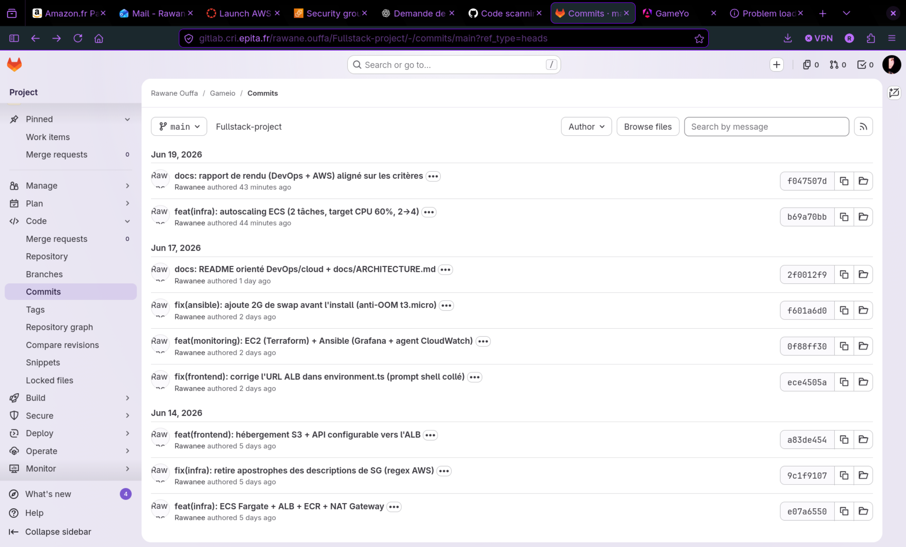
*Figure 2c — Le dépôt GitLab de rendu, synchronisé automatiquement (même dernier commit).*

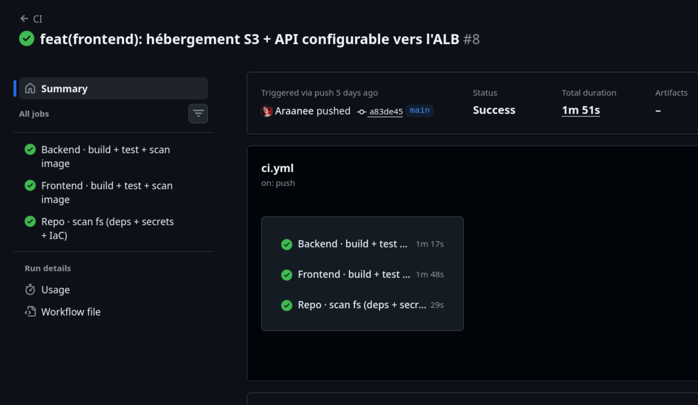
*Figure 2 — Pipeline GitHub Actions : les jobs build/tests et scans Trivy au vert.*

### 3.2 Infrastructure as Code — Terraform
Code modulaire dans `infra/modules/` : `vpc`, `rds`, `ecs`, `s3-frontend`, `monitoring`. Un point d'entrée racine câble les modules et expose les sorties (`alb_dns_name`, `frontend_url`, `grafana_url`, …). Provider épinglé, `default_tags` sur toutes les ressources pour la traçabilité.

### 3.3 Configuration — Ansible
Ansible provisionne l'EC2 de monitoring (séparation **Terraform crée / Ansible configure**) : rôles `cloudwatch_agent` (métriques système) et `grafana` (install + datasource CloudWatch). Playbook **idempotent**, avec gestion d'un fichier de swap pour fiabiliser l'installation sur petite instance.

### 3.4 Sécurité (DevSecOps)
- **Scan d'images Docker** : Trivy sur les images back et front + **scan ECR on-push**.
- **Analyse de dépendances & secrets** : Trivy filesystem (`vuln`, `secret`, `misconfig`).
- **SAST** : CodeQL (Java + JS/TS).
- **Rapports** : tous les scans publient du **SARIF** dans l'onglet *Security* de GitHub.
- **Gestion des secrets** : aucun secret versionné. Un **incident** (mot de passe PostgreSQL commité) a été traité de bout en bout : rotation du credential, externalisation en variables d'environnement, **réécriture de l'historique git**, et ajout du scan de secrets en CI pour prévenir la récidive.

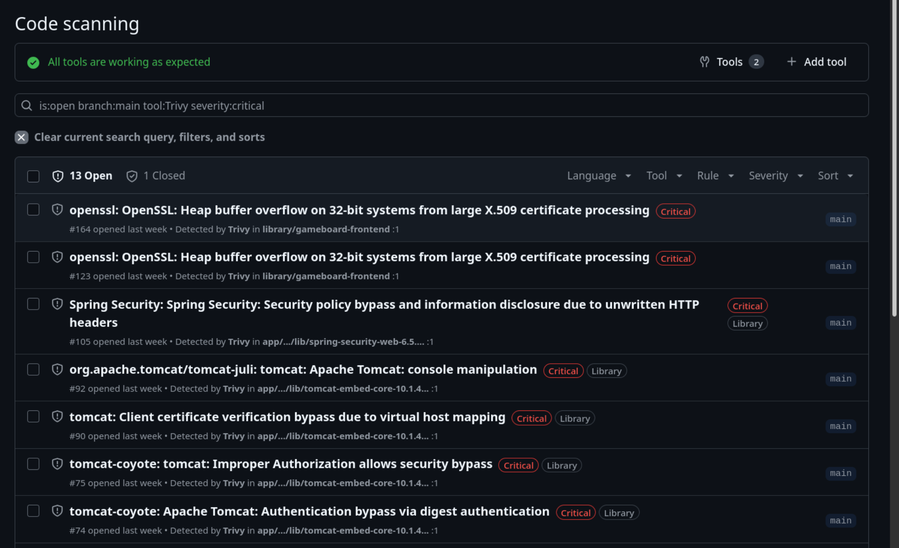
*Figure 3 — Onglet Security de GitHub : alertes remontées par les scans Trivy (SARIF). Les résultats CodeQL apparaissent au même endroit.*

### 3.5 Qualité de code
La qualité/sécurité du code est couverte par **CodeQL** (détection de patterns à risque). *Évolution identifiée : intégration de SonarCloud (gratuit sur dépôt public) pour les code smells et la couverture.*

### 3.6 Observabilité / logs
- **Logs applicatifs** : les tâches ECS streament vers **CloudWatch Logs** (`/ecs/gameboard-dev-backend`).
- **Métriques** : CloudWatch (ECS, RDS, EC2) + agent CloudWatch sur l'EC2.
- **Dashboards** : **Grafana** (datasource CloudWatch authentifiée via le rôle IAM de l'EC2).

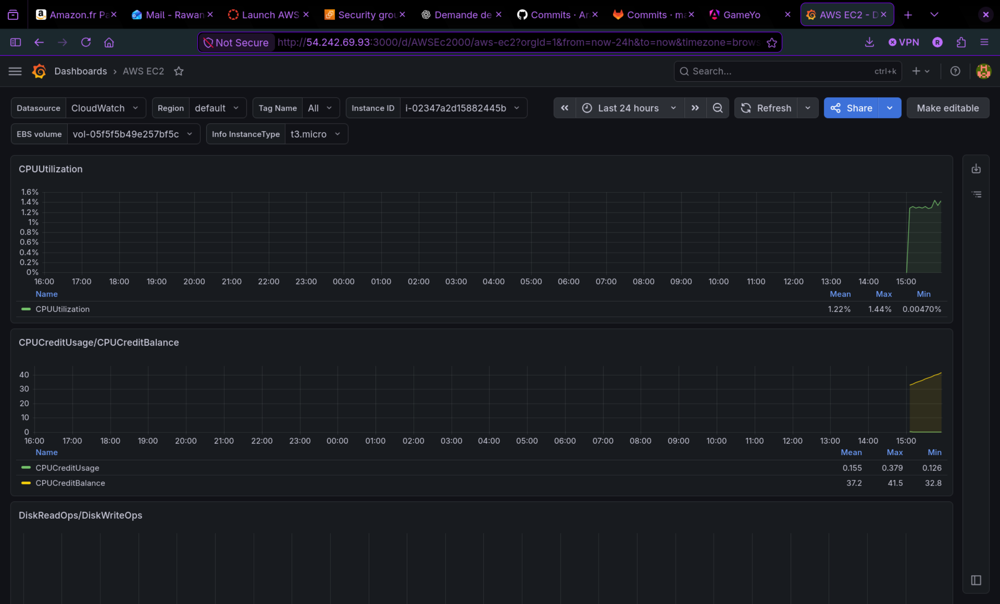
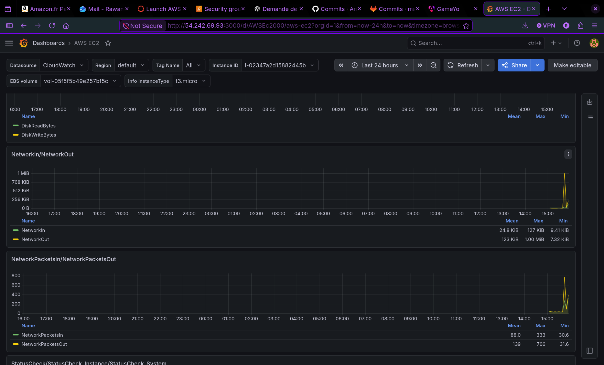
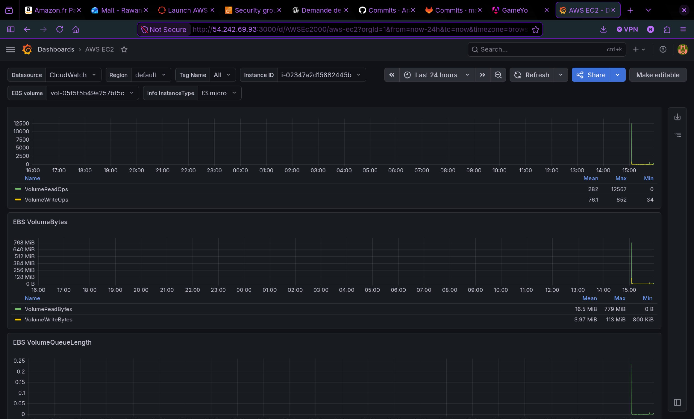
*Figure 4 — Dashboards Grafana alimentés par CloudWatch (métriques ECS / ALB / RDS).*

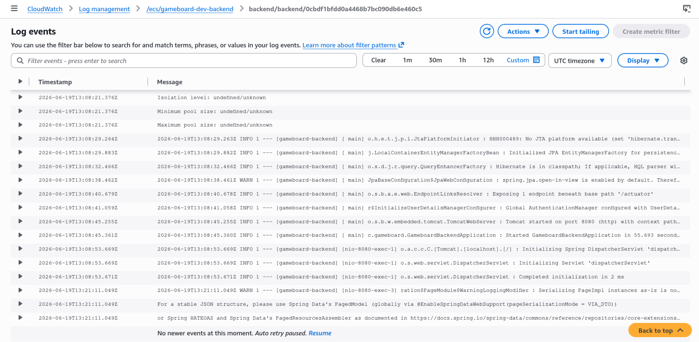
*Figure 5 — Logs du backend Spring Boot centralisés dans CloudWatch (`/ecs/gameboard-dev-backend`).*

---

## 4. Partie AWS

### 4.1 Réseau — VPC multi-AZ
VPC `10.0.0.0/16`, **2 zones de disponibilité**, **4 subnets** (2 publics, 2 privés), Internet Gateway, et **NAT Gateway** pour la sortie des subnets privés. C'est le socle exigé (réseau multi-subnet/multi-AZ).

### 4.2 Base de données — RDS
PostgreSQL 15, **subnets privés** (injoignable d'Internet), **chiffrée au repos**, accessible uniquement via Security Group. Identifiants injectés par variable d'environnement.

### 4.3 Calcul — ECS Fargate + ALB + ECR
Backend conteneurisé poussé sur **ECR**, exécuté en **Fargate** dans les subnets privés, exposé via un **Application Load Balancer** public (health check `/actuator/health`). **2 tâches réparties sur 2 AZ + autoscaling** (target tracking CPU 60 %, 2→4 tâches) → résilience et scalabilité.

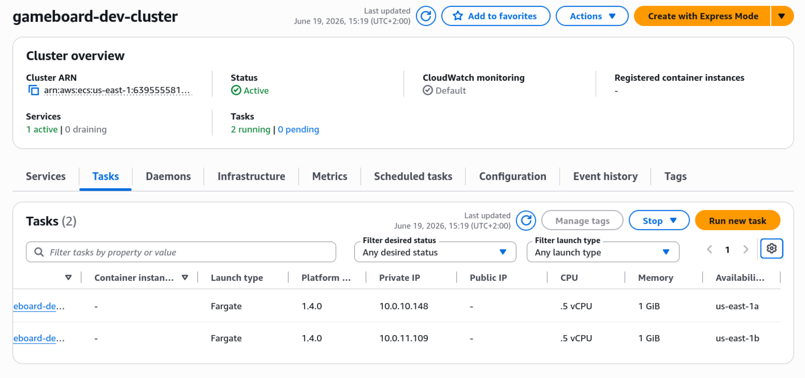
*Figure 6 — Service ECS : 2 tâches en RUNNING réparties sur 2 zones de disponibilité.*

### 4.4 Frontend — S3 statique
Build Angular hébergé sur **S3 (static website hosting)**, appelant l'API via l'ALB (CORS configuré côté backend par variable d'environnement injectée par Terraform).

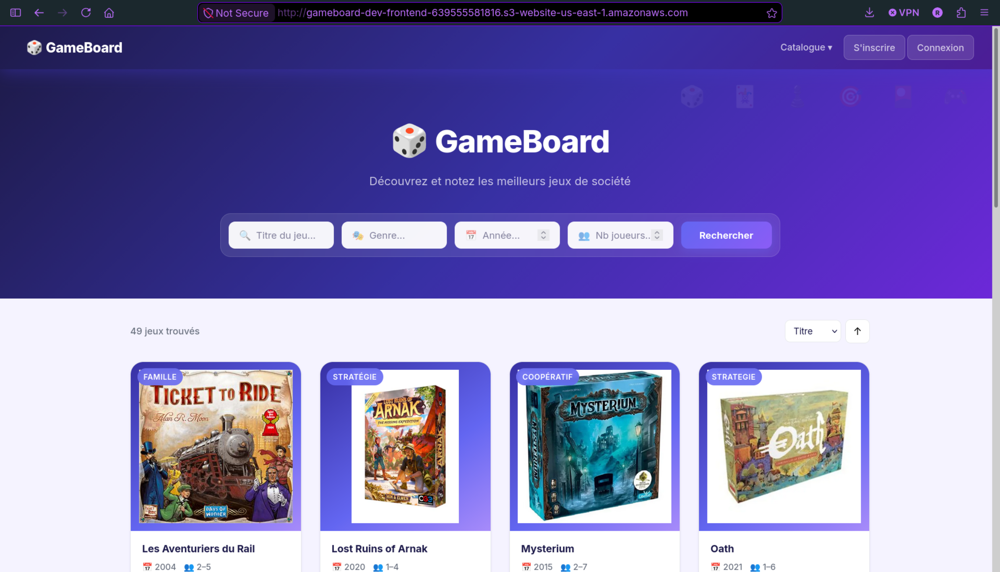
*Figure 7 — L'application en production (servie depuis S3, API via l'ALB).*

### 4.5 Supervision — EC2 monitoring
EC2 dédiée (Amazon Linux 2023) provisionnée par Ansible, hébergeant Grafana + l'agent CloudWatch.

### 4.6 Flux réseau & moindre privilège (least privilege)
Chaque couche n'accepte que le trafic de la couche précédente :
```
Internet ──:80──► [SG ALB] ──:8080──► [SG ECS] ──:5432──► [SG RDS]
            0.0.0.0/0        depuis SG ALB        depuis le VPC
```
- Le **frontend** (S3) et l'**ALB** sont les seuls points publics.
- **ECS et RDS sont en subnets privés**, sans IP publique.
- La base n'est joignable que depuis le réseau interne ; le backend, que depuis l'ALB.

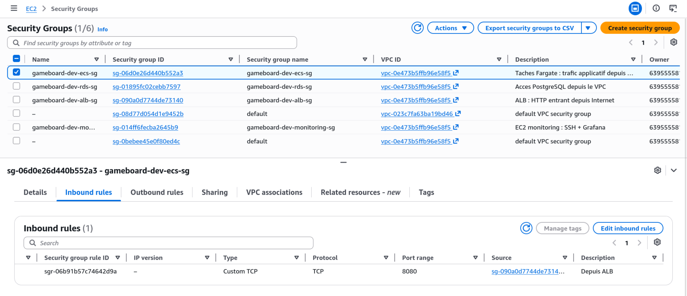
*Figure 8 — SG des tâches ECS : port 8080 autorisé uniquement depuis le SG de l'ALB.*

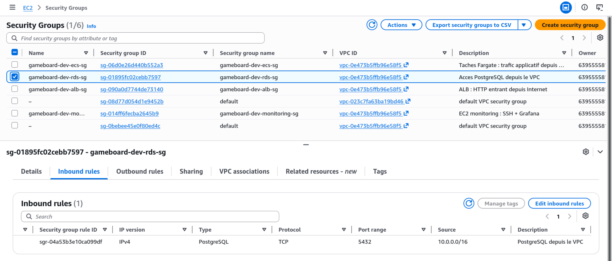
*Figure 9 — SG de la base RDS : port 5432 restreint au réseau interne.*

### 4.7 Résilience & scalabilité
- **Multi-AZ** au niveau réseau et calcul (2 tâches sur 2 AZ).
- **Autoscaling** ECS piloté par la charge CPU.
- **ALB** : répartition de charge + health checks (remplacement auto des tâches malsaines).
- *Évolutions possibles : RDS multi-AZ, CloudFront + HTTPS (ACM) devant S3/ALB.*

---

## 5. Synthèse des choix techniques

| Décision | Justification |
|---|---|
| Projet **couplé** DevOps + AWS | Une seule chaîne cohérente du code au déploiement |
| **`LabRole`** comme rôle d'exécution | Création d'IAM custom interdite (Learner Lab) |
| **ECS Fargate** (vs EC2/serverless) | Conteneurs sans gestion de serveurs, scalable, adapté à un backend Spring Boot |
| **2 tâches + autoscaling** | Résilience (2 AZ) et scalabilité automatique |
| **NAT Gateway unique** | Compromis coût/HA pour une démo |
| **RDS single-AZ** | Coût ; multi-AZ identifié comme évolution |
| **Kafka retiré du cloud** | Sans valeur en prod démo ; le code le supporte (`@ConditionalOnProperty`) |
| **Frontend S3 + HTTP** | Architecture statique simple ; HTTPS = évolution CloudFront/ACM |
| **Trivy en report-only** | Visibilité (SARIF) sans bloquer le rendu |
| **State Terraform local** | Credentials Learner Lab rotatifs |
| **CORS par variable d'env** | Découple l'origine front du build backend |

---

## 6. Conclusion
Le projet déploie une application web complète sur AWS via une chaîne **entièrement automatisée et versionnée** : CI/CD avec scans de sécurité, infrastructure Terraform modulaire, configuration Ansible, supervision Grafana/CloudWatch, et une architecture **cloisonnée selon le moindre privilège**, résiliente et scalable. Les principales pistes d'amélioration (RDS multi-AZ, HTTPS via CloudFront, SonarCloud) ont été identifiées et seraient les prochaines étapes vers une mise en production réelle.
